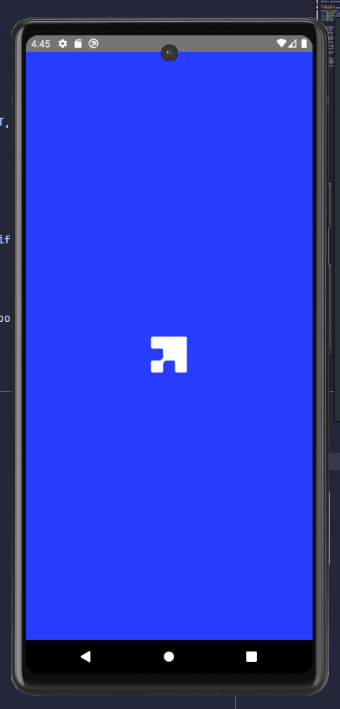
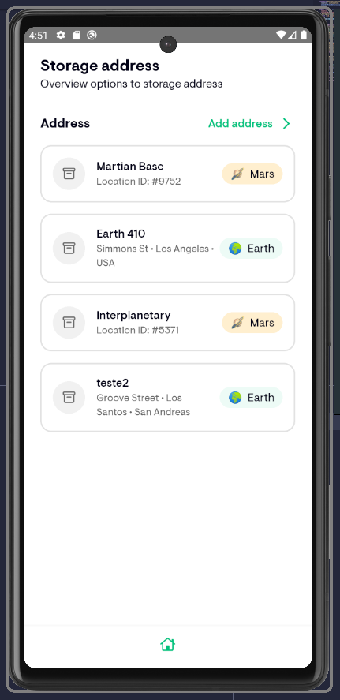
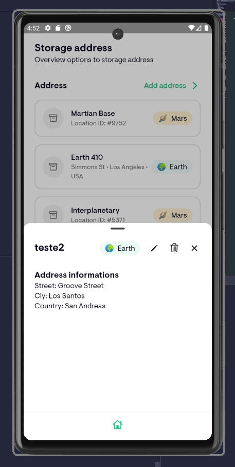
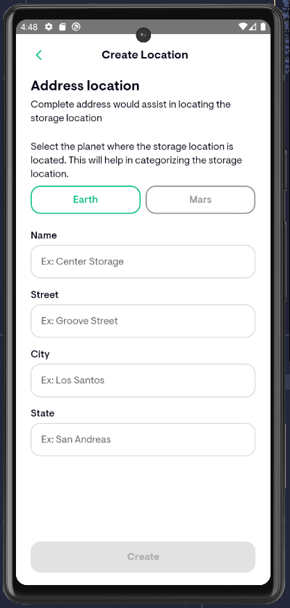
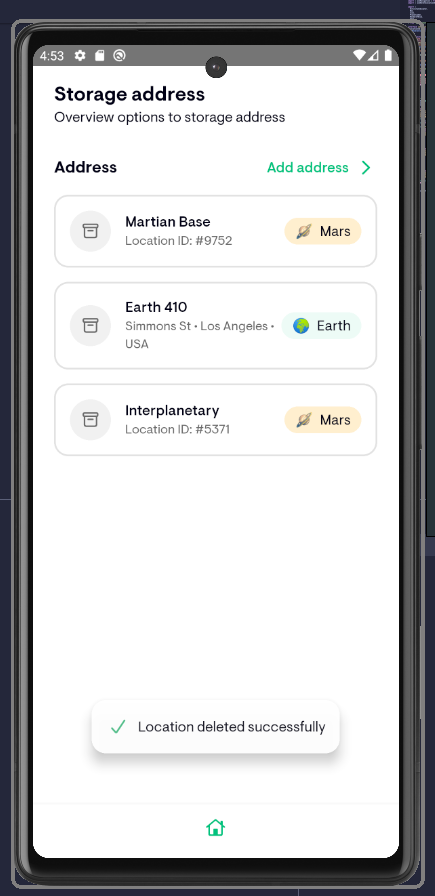

# Delivery App 🚀
---
Aplicativo criado para gerenciar delivery interplanetário 


## Sobre o App 📱
- O aplicativo foi aplicado principios de Clean Arch, utilizando React Native.

## Pacotes utilizados
- [```React Native```](https://reactnative.dev/)
- [```Typescript```](https://www.typescriptlang.org/)
- [```React Query```](https://tanstack.com/query/latest/docs/framework/react/overview)
- [```Restyle```](https://github.com/Shopify/restyle)
- [```Jest```](https://github.com/jestjs/jest)
- [```React Testing Library```](hhttps://testing-library.com/docs/react-testing-library)

---

## Telas Vertical
|   |  |  |  |  | 
|:---:|:---:|:---:|:---:|:---:|:---:|
| Splash Screen | Listagem | Detalhes | Criação | Edição | Deleção |

## Chamadas API
O aplicativo utiliza o pacote [```JSON Server```](https://www.npmjs.com/package/json-server) para chamadas API REST, por possuir uma implementação fácil, código limpo e legível.

Facilita também a criação de testes unitários.

## Avisos no app
O pacote [```JSON Server```](https://www.npmjs.com/package/json-server) é responsável pela criação da API. Para rodar corretamente o projeto, execute o comando `yarn dev:server`.

Para que funcione no Android, você precisa mapear a porta do da sua máquina para a do emulador. Quando o emulador estiver aberto basta rodar o comando `yarn art:3000`

Além disso, algum sistemas operacionais não conseguem rodar com o endereço "localhost", mas basta trocar para o IP local da API. No me caso é o endereço http://127.0.0.1:3333. Você encontra esse endereço após rodar o comando yarn dev no projeto da API.

### Possíveis erros ⚠️
Acredito que há alguns erros na tela de criação, busquei manter os schemas adaptados a partir do "Planeta", o que pode ter dado algum erro.

## Comentários finais. 💬
- O aplicativo é distribuido na versão Android, e iOS.
- Estive criando alguns pequenos testes só para demonstração.
- Próximo objetivo seria corrigir os pequenos erros e criar a possibiliade de autenticação, para isto, utilizaria a sequinte arquitetura.

[Arquitetura](https://media1-production-mightynetworks.imgix.net/asset/f2a7aad3-a820-4541-a3ee-54b4436d76fa/sign-in-flow.png?ixlib=rails-4.2.0&fm=jpg&q=75&auto=format)

--- 
